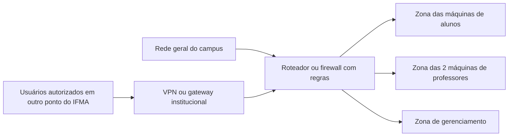
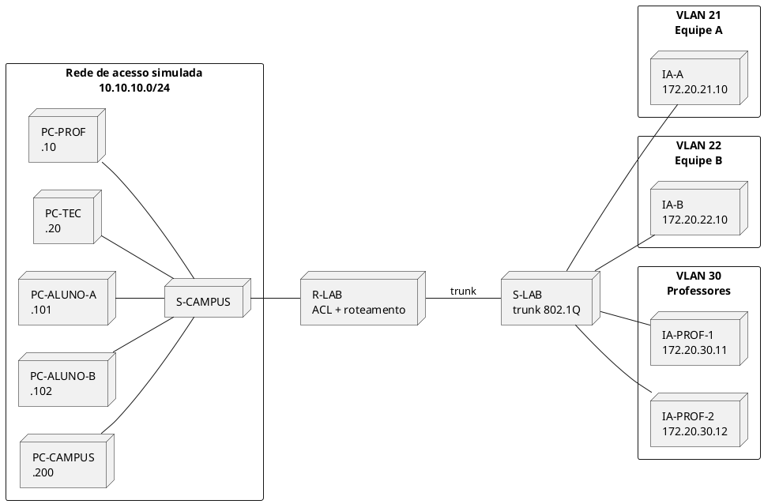

# Projeto integrador — Rede do Laboratório de Inteligência Artificial

> **Instituição:** Instituto Federal de Educação, Ciência e Tecnologia do Maranhão — Campus Itapecuru-Mirim  
> **Curso:** Técnico em Informática  
> **Disciplina:** Redes de Computadores  
> **Professor:** Thales Levi Azevedo Valente  
> **Duração:** 4 aulas de 50 minutos — 200 minutos efetivos dentro do turno de 4 horas  
> **Organização:** equipes de 3 estudantes

---

## 1. Missão da equipe

O IFMA Campus Itapecuru-Mirim pretende implantar um laboratório de Inteligência Artificial com computadores Linux. Sua equipe deverá elaborar uma **proposta preliminar da rede**, dimensionar os principais recursos e construir uma **simulação reduzida no Cisco Packet Tracer**.

A proposta deve garantir que:

- a rede do laboratório seja logicamente separada da rede geral do campus e a comunicação entre elas seja controlada;
- professor e técnico tenham acesso a todas as máquinas do laboratório;
- cada estudante acesse somente a máquina que lhe foi atribuída;
- duas máquinas de IA sejam reservadas ao uso dos professores, mantendo o acesso administrativo do técnico;
- estudantes possam criar, modificar, executar e excluir seus próprios contêineres;
- somente professor e técnico possam instalar ou alterar sistema operacional, drivers e aplicativos no sistema hospedeiro;
- usuários autorizados possam entrar remotamente, inclusive a partir de outro ponto do IFMA, por um acesso controlado;
- nenhuma máquina de IA seja exposta diretamente à Internet.

> **Segurança:** use somente nomes, endereços e configurações fictícios. Não pesquise, registre ou divulgue senhas, endereços, topologia ou configurações reais da rede do IFMA.

### Entrega obrigatória

A equipe entregará apenas:

1. este arquivo Markdown preenchido e renomeado como `equipe-N-projeto-rede-ia.md`;
2. a simulação `equipe-N-rede-ia.pkt`;
3. três imagens: topologia completa, um acesso permitido e um acesso bloqueado.

Não é necessário produzir slides ou outro relatório.

### O que o Packet Tracer comprova — e o que ele não comprova

O Packet Tracer permite representar endereçamento, VLANs, roteamento, ACLs e o caminho das mensagens. No modo *Simulation*, também permite observar eventos e o percurso de uma PDU (CISCO NETWORKING ACADEMY, [s. d.]).

Entretanto, a simulação **não comprova**:

- identidade real do usuário;
- autenticação por chave SSH;
- permissões de arquivos no Linux;
- isolamento de contêineres *rootless*;
- uso de GPU;
- segurança completa da futura implantação.

Na simulação, um endereço IP representará um usuário autenticado. Na rede real, esse controle também dependerá de contas individuais, chaves SSH, permissões Linux, gateway de acesso e regras no sistema hospedeiro.

---

## 2. Organização das quatro aulas

| Aula | Tempo | Trabalho principal | Resultado ao final |
|---|---:|---|---|
| 1 | 50 min | compreender o problema, dividir papéis e definir requisitos e permissões | seções 3 a 5 preenchidas |
| 2 | 50 min | dimensionar equipamentos, portas e endereços; revisar a proposta | seções 6 a 8 preenchidas e validadas |
| 3 | 50 min | abrir a topologia-base e configurar a simulação guiada no Packet Tracer | VLANs, gateways e ACLs configurados |
| 4 | 50 min | executar seis testes, registrar evidências e concluir | `.md` e `.pkt` revisados e entregues |

No turno de quatro horas, os demais 40 minutos ficam destinados ao intervalo e a uma margem para abertura dos computadores, dúvidas ou diagnóstico. Eles não devem ser usados para ampliar o escopo obrigatório.

Durante a terceira e a quarta aulas, o documentador deve atualizar o Markdown enquanto o configurador e o testador trabalham no Packet Tracer. A equipe não precisa esperar uma etapa terminar para começar todo o registro.

> **Regra de tempo:** ao final da segunda aula, peça o checkpoint do professor. Se houver erro no plano IP ou na matriz de acesso, corrija antes de configurar o Packet Tracer.

### Preparação obrigatória antes da aula

Para garantir o prazo de 200 minutos efetivos, o professor deverá fornecer o arquivo `Base_Rede_Lab_IA.pkt` com os dispositivos **nomeados, posicionados e cabeados**, mas ainda sem endereços, VLANs, roteamento ou ACLs. O mapa da seção 10 permite preparar e conferir essa base.

Os estudantes devem abrir a base e usar **Save As** para criar `equipe-N-rede-ia.pkt`. Se a turma precisar montar todos os dispositivos do zero, utilize a margem do turno e retire da entrega as duas evoluções futuras e o registro de IA.

---

## 3. Identificação e papéis

| Campo | Preenchimento da equipe |
|---|---|
| Nome ou número da equipe | **Preencher:** |
| Turma | **Preencher:** |
| Data | **Preencher:** |

| Integrante | Papel principal | Responsabilidade |
|---|---|---|
| **Preencher:** | Analista-documentador | registra requisitos, estimativas e decisões |
| **Preencher:** | Projetista-configurador | organiza a topologia e configura os dispositivos |
| **Preencher:** | Testador-revisor | executa testes, registra evidências e revisa a entrega |

Os papéis organizam o trabalho, mas todas as decisões devem ser conferidas pelos três integrantes.

---

## 4. Problema, objetivo e fronteira

### 4.1 Problema

Explique o problema em **até quatro linhas**. Não comece pela marca ou pelo modelo dos equipamentos.

> **Resposta da equipe:**
>
> 

### 4.2 Objetivo

Complete em **até três linhas**:

> Nossa equipe propõe uma rede para ________________________________________________, capaz de ________________________________________________, mantendo ________________________________________________.

### 4.3 Fronteira do trabalho

| Dentro desta atividade | Fora desta atividade de 4 aulas |
|---|---|
| requisitos e usuários | compra ou instalação de equipamentos reais |
| estimativa de máquinas e portas | orçamento, marcas e preços |
| topologia reduzida | levantamento da rede institucional real |
| IPv4 privado com redes `/24` | VLSM, IPv6, DHCP, DNS e NAT |
| VLAN, roteamento e ACL guiados | VPN ou WireGuard configurado |
| testes com `ping` ou Simple PDU | instalação real de Linux, SSH, Podman ou drivers |

---

## 5. Requisitos e permissões

Requisitos devem indicar um resultado observável e testável. Os mecanismos mínimos já aparecem na tabela para que a equipe não gaste a aula pesquisando soluções ainda não estudadas. Confirme a leitura; se discordar, proponha um ajuste curto.

| ID | Requisito obrigatório | Estratégia mínima indicada | Conferência da equipe |
|---|---|---|---|
| R01 | Separar logicamente a rede do laboratório e controlar sua comunicação com o campus. | sub-redes/VLANs e fronteira de roteamento | [ ] manter [ ] ajustar: |
| R02 | Impedir que um usuário comum do campus inicie acesso às máquinas do laboratório. | ACL na entrada do laboratório | [ ] manter [ ] ajustar: |
| R03 | Dar a professor e técnico acesso a todas as máquinas do laboratório. | contas administrativas e regras de rede autorizadas | [ ] manter [ ] ajustar: |
| R04 | Fazer cada estudante acessar somente a máquina atribuída. | ACL representativa + conta e chave SSH individuais | [ ] manter [ ] ajustar: |
| R05 | Reservar duas máquinas para uso dos professores, com acesso técnico para manutenção. | zona própria e ausência de contas estudantis | [ ] manter [ ] ajustar: |
| R06 | Permitir acesso remoto autenticado sem expor cada máquina diretamente à Internet. | VPN/gateway institucional e SSH | [ ] manter [ ] ajustar: |
| R07 | Permitir aos estudantes controlar seus próprios contêineres sem administrar o hospedeiro. | Podman *rootless* por usuário | [ ] manter [ ] ajustar: |
| R08 | Restringir sistema, drivers, usuários e aplicativos do hospedeiro a professor e técnico. | contas sem `sudo` para estudantes | [ ] manter [ ] ajustar: |
| R09 | Reservar portas e endereços para crescimento. | margem de expansão e plano IPv4 organizado | [ ] manter [ ] ajustar: |

### 5.1 Matriz de acesso

O princípio do menor privilégio concede apenas os recursos e autorizações necessários a cada função (NIST, [s. d.]). Confira a matriz que será testada.

| Origem | Destino | Serviço ou ação | Resultado desejado | Teste relacionado |
|---|---|---|---|---|
| Professor | qualquer máquina do laboratório | administração e uso | permitir | T1 |
| Técnico | qualquer máquina e equipamento | administração e manutenção | permitir | T2 |
| Alunos dos campus | máquinas atribuídas aos alunos | SSH e uso do ambiente | permitir | T3 |
| Usuário comum do campus | nenhuma máquina do laboratório | - | bloquear | T4 |

Explique em **até três linhas** por que permitir o acesso do professor e bloquear um usuário comum não é uma contradição.

> **Resposta da equipe:**
>
> 

O OpenSSH protege o tráfego de acesso remoto e admite diferentes mecanismos de autenticação, inclusive chaves públicas (OPENSSH, 2026). Na implantação real, a equipe técnica deverá autorizar a chave e a conta do estudante somente na máquina atribuída.

---

## 6. Responsabilidades no Linux e nos contêineres

O estudante terá autonomia **dentro de seus próprios contêineres**, não sobre o sistema Linux hospedeiro. No modo *rootless*, o Podman mantém dados por usuário e executa os contêineres sem exigir que o estudante seja administrador do hospedeiro (PODMAN PROJECT, [s. d.]).

| Ação | Aluno | Professor | Técnico |
|---|:---:|:---:|:---:|
| entrar local ou remotamente na máquina atribuída | sim | sim | sim |
| acessar máquinas atribuídas a outros estudantes para administração | não | sim | sim |
| acessar as duas máquinas exclusivas | não | sim | sim |
| baixar e construir imagens de contêiner | sim, em sua conta | sim | sim |
| criar, modificar, iniciar, parar e excluir seus contêineres | sim | sim | sim |
| criar e excluir seus volumes e redes internas de contêiner | sim | sim | sim |
| instalar bibliotecas e aplicações dentro de seus contêineres | sim | sim | sim |
| usar `sudo` no sistema hospedeiro | não | sim | sim |
| instalar ou remover Podman no hospedeiro | não | sim | sim |
| instalar drivers de GPU, alterar kernel ou sistema operacional | não | sim | sim |
| criar usuários e modificar a rede do hospedeiro | não | sim | sim |

> **Observação de implantação:** contêineres *rootless* ficam associados ao usuário que os criou. Portanto, “controle total” de professor e técnico exige acesso administrativo ao hospedeiro e um procedimento de suporte no contexto de cada conta; não significa que um único comando do Podman mostrará automaticamente os contêineres de todos os usuários.

### Explique a diferença

Em **até quatro linhas**, explique por que instalar uma biblioteca dentro do contêiner não é a mesma coisa que instalar um aplicativo ou driver no sistema hospedeiro.

> **Resposta da equipe:**
>
> 

---

## 7. Dimensionamento do laboratório real

A simulação terá poucas máquinas, mas a proposta deve estimar o laboratório real.

### 7.1 Usuários e equipamentos

| Item | Quantidade proposta | Como a equipe estimou? |
|---|---:|---|
| máquinas de IA para estudantes | **Preencher:** | **Preencher:** |
| máquinas de IA exclusivas para professores | `2` | requisito obrigatório |
| computador de administração técnica | `1` | administração local |
| gateway/servidor de acesso remoto | `1 serviço` | pode ser uma VM ou serviço institucional existente |
| pontos de acesso sem fio | `0`, salvo justificativa | Wi-Fi não faz parte da simulação obrigatória |
| outros dispositivos cabeados | **Preencher ou 0:** | **Preencher somente se necessário:** |

### 7.2 Portas de switch

Use a regra didática:

```text
portas necessárias = dispositivos cabeados + uplinks + reserva de expansão
reserva sugerida = arredondar para cima 20% dos dispositivos cabeados
```

Conte apenas equipamentos que realmente usam porta física. Uma máquina virtual no servidor existente não acrescenta uma porta própria.

| Cálculo | Resultado |
|---|---:|
| total de dispositivos cabeados | **Preencher:** |
| uplinks necessários | **Preencher:** |
| reserva de 20% | **Preencher:** |
| total de portas necessárias | **Preencher:** |
| solução escolhida: switch(es) de 24 ou 48 portas | **Preencher:** |

### Justificativa

Explique a escolha dos switches em **até três linhas**.

> **Resposta da equipe:**
>
> 

---

## 8. Zonas e plano IPv4

VLANs separam grupos lógicos; um enlace *trunk* 802.1Q pode transportar várias VLANs entre switch e roteador. Para permitir comunicação controlada entre as VLANs, é necessário roteamento (CISCO SYSTEMS, 2025b). As ACLs, por sua vez, analisam origem, destino e protocolo para permitir ou bloquear pacotes roteados; a ordem das regras é importante (CISCO SYSTEMS, 2025a).

Nesta atividade, use redes IPv4 privadas. As faixas privadas são definidas pela RFC 1918 (REKHTER et al., 1996). Os endereços abaixo são **fictícios** e servem somente à simulação.

### 8.1 Plano fixo da simulação

| Zona simulada | Rede/máscara | Gateway | Finalidade |
|---|---|---|---|
| acesso pelo campus | `10.10.10.0/24` | `10.10.10.1` | representar usuários que chegam ao roteador do laboratório |
| Equipe A | `172.20.21.0/24` | `172.20.21.1` | máquina atribuída ao Aluno A |
| Equipe B | `172.20.22.0/24` | `172.20.22.1` | máquina atribuída ao Aluno B |
| professores | `172.20.30.0/24` | `172.20.30.1` | duas máquinas exclusivas |

Não é necessário otimizar sub-redes nesta atividade. Redes `/24` foram escolhidas para concentrar o trabalho nas regras de acesso.

### 8.2 Proposta para o laboratório real

Complete sem usar dados reais do campus.

| Zona proposta | Quantidade de hosts prevista | Rede privada sugerida | O que deve acessar? |
|---|---:|---|---|
| máquinas de estudantes | **Preencher:** | **Preencher:** | **Preencher:** |
| máquinas de professores | `2` | **Preencher:** | **Preencher:** |
| gerenciamento | **Preencher:** | **Preencher:** | **Preencher:** |
| acesso remoto autenticado | **Preencher:** | **Preencher:** | **Preencher:** |

Na implantação, a equipe responsável pela rede do campus deverá validar e reservar os endereços definitivos. O plano dos estudantes é uma proposta didática, não uma autorização para configurar a rede institucional.

> **Decisão da equipe:** explique em até três linhas por que as zonas não devem formar uma única rede sem controle.
>
> 

> **Importante:** isolamento não significa desligar o laboratório do campus. Significa separar as redes e permitir apenas os fluxos necessários. Esta prova de conceito filtra principalmente conexões iniciadas pelo campus em direção ao laboratório; uma implantação real deve usar firewall ou gateway institucional para controlar os dois sentidos e registrar acessos.

### Checkpoint do professor

- [ ] Requisitos revisados.
- [ ] Quantidades e portas coerentes.
- [ ] Não foram usados dados reais do campus.
- [ ] Plano IPv4 sem redes repetidas.
- [ ] Matriz de acesso aprovada.
- [ ] Professor autorizou o início da simulação.

---

## 9. Arquitetura proposta

### 9.1 Visão conceitual da implantação



Na implantação real, o acesso remoto deverá entrar por um ponto controlado. Não se deve publicar uma porta de Internet diferente para cada computador.

### 9.2 Topologia reduzida da simulação



---

## 10. Simulação guiada no Packet Tracer

Esta etapa usa uma topologia reduzida. Abra `Base_Rede_Lab_IA.pkt`, salve imediatamente uma cópia com o nome da equipe e confira a lista abaixo. As duas máquinas estudantis representam grupos maiores da proposta real.

### 10.1 Dispositivos a conferir

- 1 roteador Cisco 2911, nomeado `R-LAB`;
- 2 switches Cisco 2960, nomeados `S-CAMPUS` e `S-LAB`;
- 5 PCs de acesso: `PC-PROF`, `PC-TEC`, `PC-ALUNO-A`, `PC-ALUNO-B` e `PC-CAMPUS`;
- 4 PCs que representam máquinas de IA: `IA-A`, `IA-B`, `IA-PROF-1` e `IA-PROF-2`.

### 10.2 Endereços dos dispositivos finais

| Dispositivo | IPv4 | Máscara | Gateway |
|---|---|---|---|
| `PC-PROF` | `10.10.10.10` | `255.255.255.0` | `10.10.10.1` |
| `PC-TEC` | `10.10.10.20` | `255.255.255.0` | `10.10.10.1` |
| `PC-ALUNO-A` | `10.10.10.101` | `255.255.255.0` | `10.10.10.1` |
| `PC-ALUNO-B` | `10.10.10.102` | `255.255.255.0` | `10.10.10.1` |
| `PC-CAMPUS` | `10.10.10.200` | `255.255.255.0` | `10.10.10.1` |
| `IA-A` | `172.20.21.10` | `255.255.255.0` | `172.20.21.1` |
| `IA-B` | `172.20.22.10` | `255.255.255.0` | `172.20.22.1` |
| `IA-PROF-1` | `172.20.30.11` | `255.255.255.0` | `172.20.30.1` |
| `IA-PROF-2` | `172.20.30.12` | `255.255.255.0` | `172.20.30.1` |

Configure os endereços em **Desktop > IP Configuration**.

### 10.3 Cabos e portas

| Ligação | Porta sugerida |
|---|---|
| `R-LAB` ↔ `S-CAMPUS` | `G0/1` do roteador ↔ qualquer porta do switch |
| `R-LAB` ↔ `S-LAB` | `G0/0` do roteador ↔ `G0/1` do switch |
| `IA-A` ↔ `S-LAB` | `F0/1` |
| `IA-B` ↔ `S-LAB` | `F0/2` |
| `IA-PROF-1` ↔ `S-LAB` | `F0/3` |
| `IA-PROF-2` ↔ `S-LAB` | `F0/4` |

### 10.4 Configuração guiada do `S-LAB`

> A sintaxe é fornecida porque VLANs, *trunk* e ACLs não são considerados conhecimentos prévios nesta atividade. Leia os nomes e associe cada comando ao plano antes de executar.

```text
enable
configure terminal
hostname S-LAB

vlan 21
 name IA_EQUIPE_A
vlan 22
 name IA_EQUIPE_B
vlan 30
 name IA_PROFESSORES

interface fastEthernet 0/1
 switchport mode access
 switchport access vlan 21
interface fastEthernet 0/2
 switchport mode access
 switchport access vlan 22
interface range fastEthernet 0/3 - 4
 switchport mode access
 switchport access vlan 30

interface gigabitEthernet 0/1
 switchport mode trunk
 switchport trunk allowed vlan 21,22,30
end
```

Verifique:

```text
show vlan brief
show interfaces trunk
copy running-config startup-config
```

- [ ] Portas `F0/1`, `F0/2`, `F0/3` e `F0/4` aparecem nas VLANs corretas.
- [ ] `G0/1` aparece como *trunk*.
- [ ] A configuração do `S-LAB` foi salva; pressione `Enter` se o equipamento pedir confirmação do nome do arquivo.

### 10.5 Configuração guiada do `R-LAB`

```text
enable
configure terminal
hostname R-LAB

interface gigabitEthernet 0/1
 ip address 10.10.10.1 255.255.255.0
 no shutdown

interface gigabitEthernet 0/0
 no shutdown

interface gigabitEthernet 0/0.21
 encapsulation dot1Q 21
 ip address 172.20.21.1 255.255.255.0

interface gigabitEthernet 0/0.22
 encapsulation dot1Q 22
 ip address 172.20.22.1 255.255.255.0

interface gigabitEthernet 0/0.30
 encapsulation dot1Q 30
 ip address 172.20.30.1 255.255.255.0
end
```

Verifique:

```text
show ip interface brief
```

- [ ] `G0/1` e as três subinterfaces estão `up`.
- [ ] Cada subinterface possui o gateway correto.

### 10.6 ACL de entrada no laboratório

As regras abaixo permitem acesso total ao professor e ao técnico, associam cada aluno à máquina atribuída e bloqueiam os demais usuários do campus. As regras TCP representam o futuro SSH; as regras ICMP permitem testar com `ping`.

Nesta prova de conceito, os acessos administrativos partem de `PC-PROF` e `PC-TEC`, que representam usuários autenticados no gateway. `IA-PROF-1` e `IA-PROF-2` são recursos de processamento, não estações usadas para administrar as demais máquinas.

```text
configure terminal
ip access-list extended ENTRADA_LAB
 permit ip host 10.10.10.10 172.20.0.0 0.0.255.255
 permit ip host 10.10.10.20 172.20.0.0 0.0.255.255
 permit tcp host 10.10.10.101 host 172.20.21.10 eq 22
 permit icmp host 10.10.10.101 host 172.20.21.10
 permit tcp host 10.10.10.102 host 172.20.22.10 eq 22
 permit icmp host 10.10.10.102 host 172.20.22.10
 deny ip any 172.20.0.0 0.0.255.255
 permit ip any any
exit

interface gigabitEthernet 0/1
 ip access-group ENTRADA_LAB in
end
```

### 10.7 Isolamento entre as máquinas estudantis

Esta ACL impede que uma máquina estudantil use o roteador para iniciar acesso a outra rede interna do laboratório.

```text
configure terminal
ip access-list extended ISOLA_ESTUDANTES
 deny ip any 172.20.0.0 0.0.255.255
 permit ip any any
exit

interface gigabitEthernet 0/0.21
 ip access-group ISOLA_ESTUDANTES in
interface gigabitEthernet 0/0.22
 ip access-group ISOLA_ESTUDANTES in
end
```

> **Limite:** dispositivos na mesma VLAN podem trocar quadros sem passar pelo roteador. A simulação usa uma VLAN por equipe para tornar a regra visível. Em uma implantação maior, seriam necessários controles adicionais, como gateway obrigatório, firewall do hospedeiro, isolamento de portas ou outra estratégia aprovada pela equipe de redes.

Verifique e salve:

```text
show access-lists
show ip interface gigabitEthernet 0/1
show ip interface gigabitEthernet 0/0.21
show ip interface gigabitEthernet 0/0.22
copy running-config startup-config
```

- [ ] A ACL `ENTRADA_LAB` está aplicada em `G0/1`, direção `in`.
- [ ] A ACL `ISOLA_ESTUDANTES` está aplicada nas VLANs 21 e 22, direção `in`.
- [ ] A configuração do `R-LAB` foi salva; pressione `Enter` se o equipamento pedir confirmação.
- [ ] O arquivo `.pkt` foi salvo com o nome solicitado.

---

## 11. Testes e evidências

Use `ping` no **Command Prompt** ou **Add Simple PDU**. Quando o resultado deveria ser permitido, faça até duas tentativas, pois a primeira pode incluir a descoberta ARP.

| Teste | Origem | Destino | Esperado | Observado | Coerente? |
|---|---|---|---|---|---|
| T1 | `PC-PROF` | `IA-A` | permitir | **Preencher:** | sim / não |
| T2 | `PC-TEC` | `IA-PROF-1` | permitir | **Preencher:** | sim / não |
| T3 | `PC-ALUNO-A` | `IA-A` | permitir | **Preencher:** | sim / não |
| T4 | `PC-ALUNO-A` | `IA-B` | bloquear | **Preencher:** | sim / não |
| T5 | `PC-ALUNO-A` | `IA-PROF-1` | bloquear | **Preencher:** | sim / não |
| T6 | `PC-CAMPUS` | `IA-A` | bloquear | **Preencher:** | sim / não |

Se houver tempo, faça um teste extra de `PC-ALUNO-B` para `IA-B`; o resultado esperado é **permitir**. Ele confirma a segunda associação, mas não exige imagem nem entra nos seis testes obrigatórios.

Se um teste divergir, confira nesta ordem:

1. IPv4, máscara e gateway;
2. cabos e interfaces `up`;
3. VLAN da porta;
4. *trunk*;
5. subinterface do roteador;
6. ordem e direção das ACLs.

### Registro das três imagens

| Evidência | Arquivo ou imagem inserida | O que demonstra? |
|---|---|---|
| E1 — topologia completa | **Preencher:** | organização dos dispositivos e zonas |
| E2 — acesso permitido | **Preencher:** | **Preencher:** |
| E3 — acesso bloqueado | **Preencher:** | **Preencher:** |

> Um `ping` permitido demonstra alcance IP; ele não prova que uma conta conseguiria autenticar-se por SSH. Um `ping` bloqueado demonstra a filtragem daquele fluxo na simulação, não a segurança completa da implantação.

### Diagnóstico, se necessário

| Teste com problema | Causa encontrada | Correção realizada | Novo resultado |
|---|---|---|---|
| **Preencher ou “não houve”:** | **Preencher:** | **Preencher:** | **Preencher:** |

---

## 12. Síntese da proposta

Escreva **de 80 a 120 palavras**. Sua síntese deve mencionar:

- quantidade estimada de máquinas e escolha de switch;
- separação entre campus, estudantes, professores e gerenciamento;
- acesso total de professor e técnico;
- acesso do estudante somente à máquina atribuída;
- diferença entre administrar contêiner e administrar o hospedeiro;
- uma limitação da simulação.

> **Síntese da equipe:**
>
> 

### Duas evoluções futuras

Não configure agora. Apenas registre duas melhorias para uma etapa posterior.

1. **Preencher:**
2. **Preencher:**

Exemplos possíveis: VPN institucional, autenticação centralizada, firewall Linux, monitoramento, cotas de CPU/RAM/GPU, sistema de reservas, DHCP, DNS, redundância ou IPv6.

---

## 13. Registro da participação

| Integrante | Principal contribuição | O que conferiu no trabalho de outro integrante? |
|---|---|---|
| **Preencher:** | **Preencher:** | **Preencher:** |
| **Preencher:** | **Preencher:** | **Preencher:** |
| **Preencher:** | **Preencher:** | **Preencher:** |

Se a equipe usou IA generativa, registre uma interação importante e como a resposta foi verificada.

| Ferramenta | Pergunta ou tarefa solicitada | O que foi aproveitado? | Como a equipe verificou? |
|---|---|---|---|
| **Preencher ou “não utilizada”:** | **Preencher:** | **Preencher:** | **Preencher:** |

---

## 14. Checklist de entrega

- [ ] O Markdown está preenchido de forma sucinta.
- [ ] A estimativa do laboratório real inclui duas máquinas dos professores.
- [ ] O cálculo de portas inclui uplink e reserva.
- [ ] O arquivo `.pkt` abre sem erro.
- [ ] Dispositivos possuem nomes legíveis.
- [ ] Não há conflito de endereços IP.
- [ ] Professor e técnico alcançam as máquinas previstas.
- [ ] O Aluno A alcança `IA-A`, mas não `IA-B` nem as máquinas dos professores.
- [ ] O usuário comum do campus não inicia acesso ao laboratório.
- [ ] Os seis testes estão registrados.
- [ ] Há exatamente três evidências visuais.
- [ ] A síntese possui entre 80 e 120 palavras.
- [ ] Nenhum dado real ou credencial do IFMA foi incluído.

---

## 15. Critérios de avaliação

| Critério | Pontos |
|---|---:|
| requisitos e matriz de permissões | 1,5 |
| dimensionamento, portas e reserva | 1,0 |
| topologia e organização das zonas | 1,5 |
| endereçamento e segmentação | 1,5 |
| regras de acesso e ACLs | 2,0 |
| seis testes e três evidências | 1,5 |
| distinção entre Linux hospedeiro e contêineres | 0,5 |
| clareza, síntese e participação da equipe | 0,5 |
| **Total** | **10,0** |

---

## Referências

CISCO NETWORKING ACADEMY. **Simulation mode: Packet Tracer tutorials**. [S. l.], [s. d.]. Disponível em: <https://tutorials.ptnetacad.net/help/default/mode_simulation.htm>. Acesso em: 22 jul. 2026.

CISCO SYSTEMS, INC. **Configure commonly used IP ACLs**. San Jose, 28 jan. 2025a. Disponível em: <https://www.cisco.com/c/en/us/support/docs/ip/access-lists/26448-ACLsamples.html>. Acesso em: 22 jul. 2026.

CISCO SYSTEMS, INC. **Configure inter VLAN routing with the use of an external router**. San Jose, 19 maio 2025b. Disponível em: <https://www.cisco.com/c/en/us/support/docs/lan-switching/inter-vlan-routing/14976-50.html>. Acesso em: 22 jul. 2026.

NATIONAL INSTITUTE OF STANDARDS AND TECHNOLOGY (NIST). **Least privilege**. Gaithersburg, [s. d.]. Disponível em: <https://csrc.nist.gov/glossary/term/least_privilege>. Acesso em: 22 jul. 2026.

OPENSSH. **OpenSSH**. Versão 10.4. [S. l.], 6 jul. 2026. Disponível em: <https://www.openssh.com/>. Acesso em: 22 jul. 2026.

PODMAN PROJECT. **podman: simple management tool for pods, containers and images**. *Podman documentation*. [S. l.], [s. d.]. Disponível em: <https://docs.podman.io/en/latest/markdown/podman.1.html>. Acesso em: 22 jul. 2026.

REKHTER, Yakov et al. **Address allocation for private internets**. RFC 1918. [S. l.]: RFC Editor, fev. 1996. Disponível em: <https://www.rfc-editor.org/rfc/rfc1918.html>. Acesso em: 22 jul. 2026.

---

> **Autoria institucional:** IFMA — Campus Itapecuru-Mirim  
> **Elaboração e docência:** Professor Thales Levi Azevedo Valente
