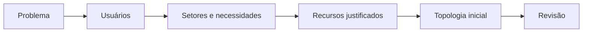
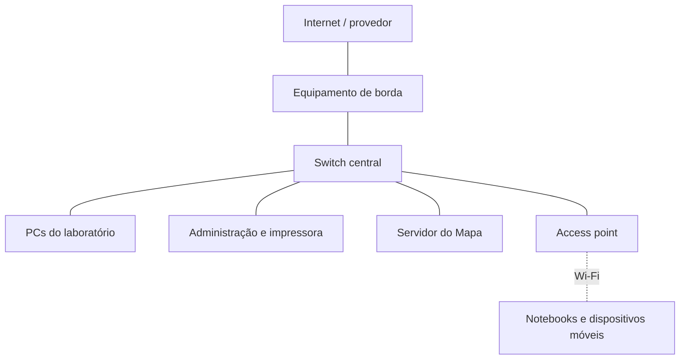
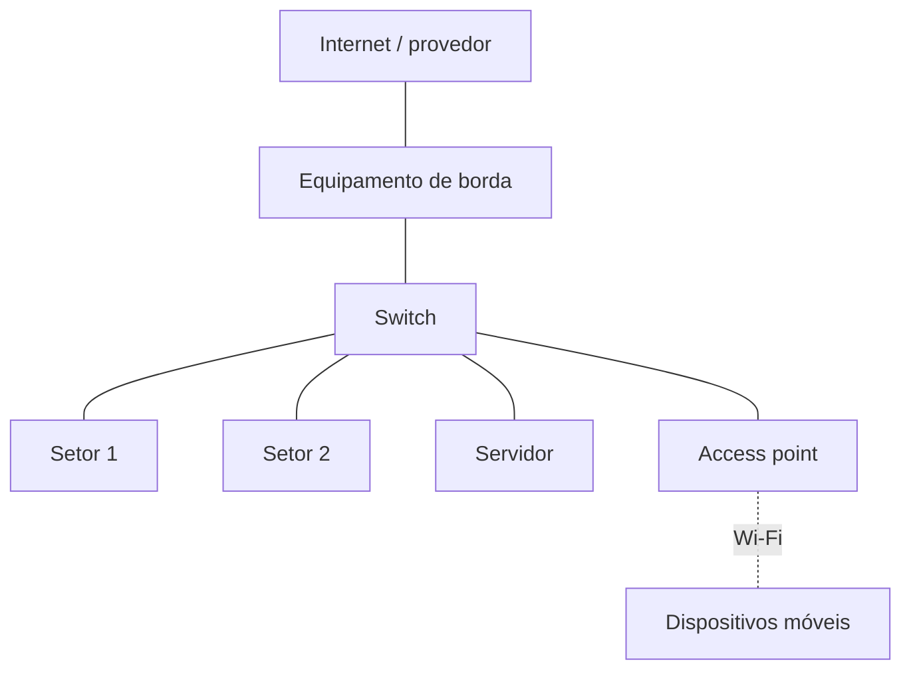

# Trilha guiada — Entrega D0: projeto inicial da rede

## Identificação

| Campo | Resposta da equipe |
|---|---|
| Nome da equipe | **Preencher:** |
| Integrantes | **Preencher:** |
| Turma | **Preencher:** |
| Nome do projeto | **Preencher:** |
| Data | **Preencher:** |

---

## 1. Missão

Nesta entrega, sua equipe produzirá a **primeira hipótese documentada da rede**. Ela ainda poderá ser corrigida nas próximas aulas.

A D0 deve responder:

1. Qual problema precisa ser resolvido?
2. Quem utilizará ou administrará a rede?
3. Quais setores ou ambientes serão atendidos?
4. Quais recursos serão necessários e por quê?
5. Como esses recursos se conectarão em uma topologia inicial?

### Resultado esperado

Entregar:

- este arquivo Markdown preenchido;
- uma topologia legível;
- as premissas e dúvidas da equipe;
- o registro de uso de IA, caso tenha sido utilizada;
- opcionalmente, o arquivo `.pkt` e evidências do Packet Tracer.

> **Atenção:** a D0 não é o projeto final. Não é necessário configurar VLAN, roteamento, firewall, VLSM ou um plano IP completo.

---

## 2. Como realizar a atividade

### Tempo sugerido

| Etapa | Tempo |
|---|---:|
| Problema e usuários | 5 min |
| Setores e necessidades | 7 min |
| Recursos e justificativas | 8 min |
| Topologia inicial | 12 min |
| Revisão técnica | 8 min |
| Organização da entrega | tempo restante |

### Formatos permitidos

Sua equipe pode trabalhar de uma destas formas:

- Markdown com diagrama Mermaid;
- papel, com fotografia legível do resultado;
- Packet Tracer, se ele já estiver instalado e funcionando;
- combinação dos formatos anteriores.

Não instale software durante a oficina sem autorização do professor. A avaliação considera o raciocínio técnico, e não a ferramenta utilizada.

### Percurso essencial e extensões

Para concluir a D0 no tempo da oficina:

- **obrigatório:** seções 5 a 12, 19, 21, 22 e 23;
- **somente se a IA for utilizada:** seção 18;
- **se o professor solicitar e houver tempo:** seção 20, revisão por outra equipe;
- **extensão opcional com o simulador:** seções 13 a 17.

O uso do Packet Tracer não substitui o preenchimento do problema, usuários, setores, recursos, justificativas e premissas.

### Papéis sugeridos

| Papel | Responsabilidade | Integrante |
|---|---|---|
| Facilitador | controla o tempo e mantém a equipe na etapa atual | **Preencher:** |
| Relator | registra as respostas | **Preencher:** |
| Diagramador | organiza a topologia | **Preencher:** |
| Revisor técnico | confere coerência e lacunas | **Preencher:** |

Se a equipe tiver menos de quatro integrantes, uma pessoa poderá assumir mais de um papel.

---

## 3. Caminho da D0



Não comece escolhendo equipamentos. Primeiro compreenda as pessoas e as atividades que a rede deverá apoiar.

---

## 4. Cenário acadêmico de referência

Caso o professor não determine outro cenário, considere o **Centro de Tecnologia e Memórias Comunitárias**, relacionado ao Mapa Interativo de Memórias Quilombolas.

Informações iniciais conhecidas:

- administração com 1 PC e 1 impressora de rede;
- laboratório com 20 PCs;
- professores usando notebooks por Wi-Fi;
- visitantes usando dispositivos móveis por Wi-Fi;
- servidor do Mapa de Memórias;
- acesso à Internet por enlace do provedor;
- necessidade futura de proteger os recursos internos do acesso de visitantes.

Este é um cenário didático. Não pesquise nem inclua senhas, endereços reais, detalhes da rede institucional ou informações pessoais.

### Cenário adotado pela equipe

> **Resposta da equipe:** indique se utilizará o cenário comum ou outro cenário autorizado pelo professor.

**Preencher:**


---

# Parte A — Compreensão do problema

## 5. Escreva o problema

Um problema adequado descreve:

- o contexto;
- as pessoas afetadas;
- o que elas precisam fazer;
- a dificuldade atual.

### Não faça assim

> “Precisamos comprar dois switches e um roteador.”

Essa frase já escolheu equipamentos, mas ainda não explicou a necessidade.

### Estrutura de apoio

> No contexto de **[local]**, **[grupos de usuários]** precisam **[atividades ou serviços]**, mas **[dificuldade atual]**, o que prejudica **[impacto]**.

### Problema formulado pela equipe

> **Resposta da equipe — escreva um parágrafo:**


### Verificação rápida

- [ ] Identificamos o contexto.
- [ ] Dissemos quem é afetado.
- [ ] Explicamos o que as pessoas precisam realizar.
- [ ] Evitamos começar pela compra de equipamentos.

---

## 6. Identifique os usuários

Usuário é um grupo de pessoas que utiliza ou administra a rede. Não confunda usuário com conta de login, computador ou setor.

| Grupo de usuários | Quantidade estimada | O que precisa fazer na rede | Prioridade |
|---|---:|---|---|
| **Preencher:** | **Preencher:** | **Preencher:** | alta / média / baixa |
| **Preencher:** | **Preencher:** | **Preencher:** | alta / média / baixa |
| **Preencher:** | **Preencher:** | **Preencher:** | alta / média / baixa |
| **Preencher:** | **Preencher:** | **Preencher:** | alta / média / baixa |
| **Preencher:** | **Preencher:** | **Preencher:** | alta / média / baixa |

### Quem administrará ou manterá a rede?

> **Resposta da equipe:**


---

## 7. Identifique os setores ou ambientes

Setor é uma área física ou organizacional. Exemplos: laboratório, administração, sala técnica e área de visitantes.

> **Setor não é sinônimo de sub-rede.** A separação lógica será estudada e decidida posteriormente.

| Setor ou ambiente | Usuários atendidos | Dispositivos previstos | Necessidades principais |
|---|---|---:|---|
| **Preencher:** | **Preencher:** | **Preencher:** | **Preencher:** |
| **Preencher:** | **Preencher:** | **Preencher:** | **Preencher:** |
| **Preencher:** | **Preencher:** | **Preencher:** | **Preencher:** |
| **Preencher:** | **Preencher:** | **Preencher:** | **Preencher:** |

### Há ambientes, distâncias ou obstáculos que ainda precisam ser conhecidos?

> **Resposta da equipe:**


---

## 8. Liste necessidades e serviços

Uma **necessidade** descreve o que alguém precisa realizar. Um **serviço** é uma funcionalidade disponibilizada pela rede.

Exemplos de serviços:

- acesso à Internet;
- acesso ao Mapa de Memórias;
- impressão em rede;
- compartilhamento de arquivos;
- acesso sem fio;
- administração da infraestrutura.

| Usuário ou setor | Necessidade | Serviço relacionado | Importância | Como saberemos que funciona? |
|---|---|---|---|---|
| **Preencher:** | **Preencher:** | **Preencher:** | alta / média / baixa | **Preencher:** |
| **Preencher:** | **Preencher:** | **Preencher:** | alta / média / baixa | **Preencher:** |
| **Preencher:** | **Preencher:** | **Preencher:** | alta / média / baixa | **Preencher:** |
| **Preencher:** | **Preencher:** | **Preencher:** | alta / média / baixa | **Preencher:** |
| **Preencher:** | **Preencher:** | **Preencher:** | alta / média / baixa | **Preencher:** |

---

# Parte B — Da necessidade à proposta

## 9. Selecione recursos e justifique

Cada recurso listado deve atender a uma necessidade identificada anteriormente.

### Lembrete de funções

| Recurso | Função principal neste nível do projeto |
|---|---|
| Switch | conecta dispositivos cabeados dentro da LAN |
| Roteador | interliga redes e permite alcançar destinos externos |
| Access point | oferece acesso sem fio à rede local |
| Servidor | disponibiliza serviços e dados aos clientes |
| ONT/modem do provedor | termina ou adapta o enlace entregue pelo provedor |
| Firewall | controla tráfego conforme regras de segurança; pode estar integrado a outro equipamento |
| Cabo de cobre | conecta dispositivos cabeados em distâncias compatíveis |
| Fibra óptica | atende enlaces que justifiquem maior distância, capacidade ou imunidade a interferência |

### Recursos propostos

| Recurso | Quantidade inicial | Necessidade atendida | Justificativa | Dúvida ou premissa |
|---|---:|---|---|---|
| **Preencher:** | **Preencher:** | **Preencher:** | **Preencher:** | **Preencher:** |
| **Preencher:** | **Preencher:** | **Preencher:** | **Preencher:** | **Preencher:** |
| **Preencher:** | **Preencher:** | **Preencher:** | **Preencher:** | **Preencher:** |
| **Preencher:** | **Preencher:** | **Preencher:** | **Preencher:** | **Preencher:** |
| **Preencher:** | **Preencher:** | **Preencher:** | **Preencher:** | **Preencher:** |
| **Preencher:** | **Preencher:** | **Preencher:** | **Preencher:** | **Preencher:** |

### Conferência de capacidade

1. Quantas conexões cabeadas são necessárias inicialmente?

> **Resposta:**


2. Quantas portas deverão ficar livres para expansão?

> **Resposta:**


3. A quantidade de portas dos switches propostos é suficiente? Demonstre a conta.

> **Resposta e cálculo:**


4. Quais usuários necessitam de Wi-Fi?

> **Resposta:**


5. A quantidade de access points é conhecida ou ainda depende de levantamento de área, obstáculos e quantidade de usuários?

> **Resposta:**


---

## 10. Registre premissas e perguntas em aberto

Não invente uma informação que não foi fornecida. Registre-a.

| Tipo | Premissa ou pergunta | Por que importa? | Como será confirmada? |
|---|---|---|---|
| premissa / pergunta | **Preencher:** | **Preencher:** | **Preencher:** |
| premissa / pergunta | **Preencher:** | **Preencher:** | **Preencher:** |
| premissa / pergunta | **Preencher:** | **Preencher:** | **Preencher:** |
| premissa / pergunta | **Preencher:** | **Preencher:** | **Preencher:** |

---

# Parte C — Topologia inicial

## 11. Desenhe a topologia

A topologia deve permitir que outra pessoa reconheça:

- onde a rede recebe o enlace externo;
- qual equipamento interliga a rede interna à rede externa;
- onde os dispositivos cabeados se concentram;
- onde está o servidor;
- como os clientes sem fio entram na rede;
- quais elementos pertencem a cada setor.

### Exemplo didático simplificado



Esse é apenas um exemplo de leitura. A equipe deve adaptar a topologia às necessidades e aos recursos que registrou.

### Modelo Mermaid para copiar e editar

Copie o bloco abaixo, substitua os textos e acrescente ou remova elementos. Mantenha identificadores curtos e únicos antes dos colchetes.

````text

````

### Topologia da equipe

Substitua este espaço pelo diagrama Mermaid, pela imagem do desenho ou por uma captura legível do Packet Tracer.

> **Inserir topologia aqui:**


### Explique a leitura da topologia

1. Por onde o tráfego entra e sai da rede?

> **Resposta:**


2. Qual é o ponto central das conexões cabeadas?

> **Resposta:**


3. Onde o servidor está conectado?

> **Resposta:**


4. Como os dispositivos sem fio entram na LAN?

> **Resposta:**


5. Quais decisões de segurança ainda não estão representadas?

> **Resposta:**


---

## 12. Checklist técnico da topologia

- [ ] Todo equipamento listado aparece no desenho, ou a ausência foi justificada.
- [ ] Todo elemento desenhado aparece na lista de recursos.
- [ ] Os cabos chegam exatamente aos equipamentos.
- [ ] O switch concentra os dispositivos cabeados.
- [ ] O servidor está conectado ao switch, e não entre o switch e os clientes.
- [ ] O access point está ligado à rede cabeada.
- [ ] Os clientes Wi-Fi se conectam ao access point.
- [ ] Existe um equipamento responsável por interligar a LAN à rede externa quando há Internet.
- [ ] Se houver firewall separado, ele está no caminho do tráfego.
- [ ] Não afirmamos que setores já são sub-redes.
- [ ] O desenho está legível e não possui linhas ou rótulos ambíguos.

### Correções feitas após o checklist

> **Resposta da equipe:**


---

# Parte D — Validação opcional no Cisco Packet Tracer

## 13. Quando utilizar o simulador

Esta etapa é **opcional na D0**. Realize-a somente se o Packet Tracer já estiver disponível e autorizado no laboratório.

O simulador pode ajudar a:

- conferir se os equipamentos estão conectados;
- verificar se as interfaces estão ativas;
- reaproveitar a LAN construída na Aula 3;
- testar `ping` entre dispositivos locais;
- observar eventos ARP e ICMP como preparação para a próxima aula.

Se o programa não estiver disponível, avance para a Parte E. Não faça instalação durante a oficina.

---

## 14. Monte ou adapte a topologia no Packet Tracer

### Opção recomendada

Abra o arquivo `.pkt` produzido na Aula 3 e salve uma cópia com outro nome:

```text
D0-equipe-nome-do-projeto.pkt
```

### Caso seja necessário recriar a LAN básica

1. Em **End Devices**, adicione os PCs e um servidor.
2. Em **Network Devices → Switches**, adicione um switch, como o 2960 disponível no simulador.
3. Em **Connections**, use **Automatically Choose Connection Type** ou **Copper Straight-Through**.
4. Conecte `FastEthernet0` de cada PC/servidor a uma porta Ethernet livre do switch.
5. Aguarde os indicadores das portas ficarem ativos.
6. Renomeie os dispositivos para que o desenho seja compreensível.

> **Dica:** não use roteador somente para fazer dois hosts da mesma sub-rede se comunicarem. A LAN básica da Aula 3 funciona com PCs, servidor e switch.

### Plano de teste opcional

Use estes endereços somente para validar a LAN reaproveitada da Aula 3; eles não constituem o plano IP completo da D0.

| Dispositivo | IPv4 | Máscara | Gateway neste teste local |
|---|---|---|---|
| PC0 | `192.168.10.10` | `255.255.255.0` | deixar vazio |
| PC1 | `192.168.10.11` | `255.255.255.0` | deixar vazio |
| Servidor | `192.168.10.20` | `255.255.255.0` | deixar vazio |

Configure cada equipamento em **Desktop → IP Configuration**.

### Registro da montagem

| Verificação | Resultado/observação |
|---|---|
| Dispositivos adicionados | **Preencher:** |
| Portas utilizadas | **Preencher:** |
| Estado visual dos enlaces | **Preencher:** |
| Nome do arquivo salvo | **Preencher:** |

---

## 15. Comandos de verificação nos PCs

Abra um PC e acesse **Desktop → Command Prompt**.

### Ver endereço configurado

```console
ipconfig
```

> **O endereço exibido corresponde ao planejamento?**

**Resposta:**


### Testar PC1

No PC0:

```console
ping 192.168.10.11
```

> **O teste foi bem-sucedido? Copie ou resuma o resultado.**

**Resposta:**


### Testar o servidor

No PC0:

```console
ping 192.168.10.20
```

> **O teste foi bem-sucedido? O que esse resultado comprova e o que ele não comprova?**

**Resposta:**


### Consultar a tabela ARP do PC

Depois do `ping`, tente:

```console
arp -a
```

> **Quais endereços IPv4 e MAC aparecem associados?**

**Resposta:**


> **Observação:** se a versão disponível do simulador não aceitar esse comando, registre a limitação e use o modo Simulation para observar ARP.

---

## 16. Comandos de observação no switch

Clique no switch e abra a aba **CLI**. Estes comandos apenas consultam o estado; não é necessário configurar o switch nesta D0.

```text
enable
show mac address-table
show interfaces status
```

Se `show interfaces status` não estiver disponível na versão utilizada, tente:

```text
show interfaces
```

### Respostas

1. Quais endereços MAC foram aprendidos pelo switch?

> **Resposta:**


2. Em quais portas eles aparecem?

> **Resposta:**


3. A tabela estava vazia antes dos testes? O que mudou depois do `ping`?

> **Resposta:**


4. Alguma interface utilizada aparece inativa? Qual?

> **Resposta:**


---

## 17. Observe ARP e ICMP no modo Simulation

1. Mude de **Real-Time** para **Simulation**.
2. Em **Edit Filters**, deixe visíveis somente **ARP** e **ICMP**.
3. Limpe eventos anteriores, se necessário.
4. Gere um `ping` pelo Command Prompt ou use **Add Simple PDU**.
5. Se utilizar **Add Simple PDU**, clique primeiro no dispositivo de origem e depois no destino.
6. Use **Capture/Forward** para avançar um evento por vez.
7. Clique nos eventos da lista para observar os detalhes da PDU.
8. Ao concluir, use **Reset Simulation** ou retorne ao modo Real-Time.

### Observações da equipe

1. Qual protocolo apareceu primeiro: ARP ou ICMP?

> **Resposta:**


2. Qual pergunta o ARP tentou responder?

> **Hipótese da equipe:**


3. Quais dispositivos receberam o primeiro evento ARP?

> **Resposta:**


4. Quais dispositivos efetivamente responderam ao `ping`?

> **Resposta:**


5. Insira uma captura ou descreva o evento mais importante.

> **Evidência/descrição:**


> Esta observação é apenas uma preparação. Ethernet, quadros, endereços MAC, funcionamento do switch e ARP serão aprofundados na próxima aula.

---

# Parte E — Revisão e entrega

## 18. Use IA generativa com responsabilidade

A IA pode ajudar a encontrar lacunas, formular perguntas e revisar coerência. Ela não deve decidir o projeto sem avaliação da equipe.

### Prompt sugerido para revisão

```text
Atue como revisor de uma proposta inicial de rede para um curso técnico.
Não reescreva o trabalho e não invente requisitos.

Analise a descrição abaixo e:
1. aponte necessidades sem recurso correspondente;
2. aponte recursos sem justificativa;
3. identifique elementos ausentes ou ligações incoerentes na topologia;
4. faça até cinco perguntas que a equipe ainda precisa responder;
5. diferencie erro técnico, informação desconhecida e decisão de projeto.

Descrição da equipe:
[cole aqui problema, usuários, setores, recursos e topologia]
```

### Registro obrigatório, se a IA foi utilizada

| Campo | Resposta |
|---|---|
| Ferramenta utilizada | **Preencher:** |
| Prompt utilizado | **Preencher ou anexar:** |
| Sugestões aceitas | **Preencher:** |
| Sugestões rejeitadas | **Preencher:** |
| Como verificamos as sugestões | **Preencher:** |
| Correções feitas pela equipe | **Preencher:** |

### Cuidados

- não forneça senhas;
- não forneça endereços reais da instituição;
- não forneça dados pessoais;
- não aceite equipamento apenas porque a IA o sugeriu;
- confirme se cada sugestão atende a uma necessidade registrada.

---

## 19. Justifique a proposta

Escreva de cinco a oito frases explicando:

- como a proposta atende ao problema;
- por que os principais equipamentos foram escolhidos;
- como a topologia conecta os setores;
- quais decisões ainda são provisórias;
- o que precisará ser estudado ou validado depois.

> **Justificativa da equipe:**


---

## 20. Revisão por outra equipe

| Pergunta de revisão | Sim | Ainda não | Comentário do revisor |
|---|:---:|:---:|---|
| O problema está claro e não começa pela solução? | [ ] | [ ] | **Preencher:** |
| Usuários e setores estão diferenciados? | [ ] | [ ] | **Preencher:** |
| Cada necessidade importante possui recurso correspondente? | [ ] | [ ] | **Preencher:** |
| Cada recurso possui justificativa? | [ ] | [ ] | **Preencher:** |
| A topologia é tecnicamente coerente e legível? | [ ] | [ ] | **Preencher:** |
| As premissas e dúvidas estão registradas? | [ ] | [ ] | **Preencher:** |

### Alterações realizadas após a revisão

> **Resposta da equipe:**


---

## 21. Checklist final de aceitação

### Conteúdo

- [ ] O problema informa contexto, usuários, necessidade e dificuldade.
- [ ] Os grupos de usuários foram identificados.
- [ ] Os setores ou ambientes foram descritos.
- [ ] As necessidades e os serviços foram registrados.
- [ ] Os recursos têm quantidade inicial, função e justificativa.
- [ ] Premissas e perguntas em aberto foram registradas.

### Topologia

- [ ] A topologia pode ser compreendida sem explicação oral.
- [ ] Os equipamentos listados e desenhados são consistentes.
- [ ] Os dispositivos cabeados e sem fio estão conectados coerentemente.
- [ ] A conexão com a rede externa está representada, quando necessária.
- [ ] O desenho não confunde setor com sub-rede.

### Qualidade da entrega

- [ ] O arquivo está legível.
- [ ] A equipe revisou ortografia e nomes técnicos.
- [ ] O uso de IA foi registrado, se ocorreu.
- [ ] Nenhum dado sensível foi incluído.
- [ ] O arquivo foi salvo com o nome correto.

---

## 22. Organização dos arquivos

Nome principal:

```text
D0-equipe-nome-do-projeto.md
```

Arquivos opcionais:

```text
D0-equipe-nome-do-projeto.pkt
D0-equipe-nome-do-projeto-topologia.png
D0-equipe-nome-do-projeto-evidencia-01.png
```

Estrutura sugerida:

```text
projeto-rede/
├── docs/
│   └── entregas/
│       ├── D0-equipe-nome-do-projeto.md
│       └── imagens/
│           ├── topologia.png
│           └── evidencia-01.png
└── simulacao/
    └── D0-equipe-nome-do-projeto.pkt
```

### Local ou forma de entrega definida pelo professor

> **Preencher em aula:**


---

## 23. Síntese da equipe

### Principal decisão tomada

> **Resposta:**


### Maior dúvida ainda existente

> **Resposta:**


### O que esperamos compreender na próxima aula

> **Resposta:**


---

## Referências e apoio

- [Cisco Packet Tracer — página oficial](https://skillsforall.com/topics/cisco-packet-tracer)
- [Cisco Networking Academy — Getting Started with Cisco Packet Tracer](https://skillsforall.com/course/getting-started-cisco-packet-tracer)
- [Cisco — Explore Network Functionality Using PDUs](https://contenthub.netacad.com/legacy/I2PT/1.1/en/course/files/3.1.1.3%20Packet%20Tracer%20-%20Explore%20Network%20Functionality%20Using%20PDUs.pdf)
- [Cisco — Use Ping and Traceroute to Test Network Connectivity](https://www.netacad.com/content/itn/1.0/courses/content/m13/en-US/assets/13.3.2-packet-tracer---use-ping-and-traceroute-to-test-network-connectivity---physical-mode.pdf)

Material preparado para uso didático no Curso Técnico em Informática. As instruções do Packet Tracer foram mantidas independentes de uma versão específica; nomes e posições de controles podem variar ligeiramente conforme a versão disponível no laboratório.
